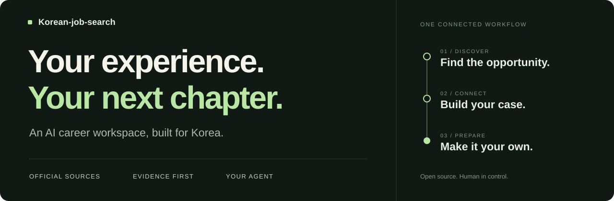

<p>
  
</p>

# New opportunities. Not a fresh start every time.

Find roles, connect them to your experience, and prepare for applications and interviews.<br>
**Korean-job-search brings the scattered work of a Korean job search into one open-source AI workspace.**

Keep the agent you already use. Add a workflow built around Korean hiring, and build on your experience instead of explaining it again for every application.

[Get started](#start) · [Usage guide](docs/USAGE.en.md) · [Agent setup](docs/AGENTS_COMPATIBILITY.md) · [한국어](README.md)

---

## Build a grounded answer to “Why you?”

Every new role can mean another chat, another explanation of your career, and another plausible-sounding draft to fact-check.

Korean-job-search focuses on **the connection between what you have actually done and what an employer needs**. Official job descriptions, evidence from your experience, and the current application questions stay part of the same workflow.

### Discover the opportunity

Start with official recruiting references for **100 major Korean employers**, then supplement discovery with **Saramin, JobKorea and Wanted**. Check eligibility and deadlines against the original posting. An optional [Scrapling workflow bundled with the skill](.agents/skills/korean-job-search/references/scrapling.md) helps read public pages the basic collectors do not handle. A blocked source is never reported as an employer with no vacancies.

### Connect your experience

Compare the role's requirements with your projects, responsibilities and evidence. Identify which experience belongs in the answer, what you personally contributed, and what still needs confirmation. Korean writing guides distinguish motivation, collaboration, failure and AI-use questions rather than recycling one story everywhere.

### Prepare with care

Review agent-written answers for facts, relevance, personal attribution and length. Check Korean character or byte limits with deterministic tools, then carry the application into interview preparation and local tracking. **You make the final decision and submit the application.**

## Your agent. A workflow built for Korean hiring.

**Hermes · Prime Agent · Codex · Claude Code · OpenClaw**

A shared Agent Skill and thin adapters let different agents work with the same project files and instructions. Generic `AGENTS.md` and Gemini pointers are included too.

The agent reads, reasons and writes; the Python tools store job observations, count text and track applications. The CLI does not embed an LLM. Your host supplies its own authentication and search capabilities. Follow the [agent-specific setup notes](docs/AGENTS_COMPATIBILITY.md).

<a id="start"></a>

## Start small

### 1. Create your workspace

With Python 3.10+, open the repository directory and run:

```bash
python3 -m korean_job_search init
```

The default CLI needs no third-party runtime libraries. It creates a blank profile and story templates in the Git-ignored `workspace/`. Keep your resume and evidence where they are; tell your agent the folder path so it can read only the relevant files and write its working profile and drafts to `workspace/`. The repository's Git ignore rule does not cover your original folder.

### 2. Give your agent a starting point

Open your preferred agent in this repository and ask:

```text
Read AGENTS.md and .agents/skills/korean-job-search/SKILL.md before proceeding.

My resume and career documents are in [absolute path to my documents folder]. Read only the files you need; do not move, copy or edit the originals.
Find Korean AI product-planning or business-development roles.
Verify the official JD and eligibility, then explain how my experience relates to the role.
Ask about missing information. Do not invent experience or submit applications.
```

Replace `[absolute path to my documents folder]` with the actual folder path.

You do not need to run the whole workflow at once. Start with one job description to evaluate or one application answer to review.

> **Keep the originals where they are; keep new work in your workspace.** Keep personal details out of shared skills and agent instructions. A cloud-backed agent may still send the material it reads to its model provider. [Privacy notes](SECURITY.md)

## Checked against real postings

| What was checked | Recorded result |
| :--- | :--- |
| Recruiting references | 100 employers and 258 evidence records; 96 employer records verified, 4 partially verified |
| Live workflow | 15 listing records from NAVER, CJ and Saramin; a real NAVER product-planning JD read before generating a drafting packet and HTML report |
| Base tooling | The initial 243 tests passed on Python 3.11 and 3.13 and an isolated package installation; independent quality re-review approved |
| Scrapling helper | Live listing extraction → detail-iframe JD → existing import workflow checked. [Additional verification](artifacts/SCRAPLING_VERIFICATION.md) |

These are execution results, not hiring odds or complete market coverage. Read the [verification record and evidence](artifacts/VERIFICATION.md).

**The boundaries are explicit.** The employer directory is curated, not a financial top-100 ranking. The optional Scrapling helper reads public JobKorea HTML and detail iframes missed by the core parser. Wanted public-page readability is separate from robots-policy verification; automation stops when that policy cannot be established. Initial Kakao and Lotte requests also stopped on robots verification failures. Complete extraction from every site is not guaranteed. Adapter files were checked, but actual model-driven work was not tested in all five agents.

## Go deeper

[Commands and workflow](docs/USAGE.en.md) · [Agent configuration](docs/AGENTS_COMPATIBILITY.md) · [Collectors and access boundaries](docs/COLLECTORS.md) · [Shared skill](.agents/skills/korean-job-search/SKILL.md)

---

Adapted from the job-preparation workflow in [MadsLorentzen/ai-job-search](https://github.com/MadsLorentzen/ai-job-search) for Korean hiring and multiple agents. [Provenance and changes](UPSTREAM.md) · [MIT License](LICENSE)
