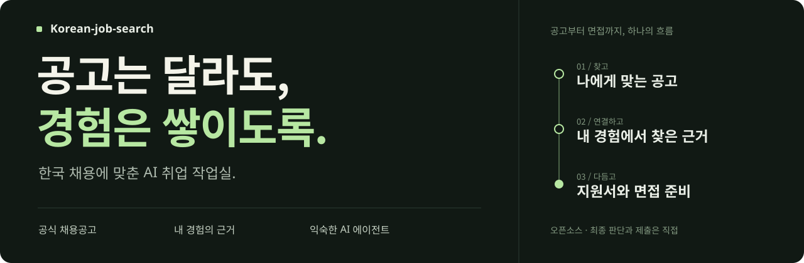

<p>
  
</p>

# 공고는 달라도, 경험은 쌓이도록.

채용공고를 찾고, 내 경험과 연결하고, 지원서와 면접을 준비하는 일까지.<br>
**Korean-job-search는 흩어진 취업 준비를 하나의 흐름으로 이어주는 오픈소스 AI 작업실입니다.**

익숙한 AI 에이전트에 한국 채용에 맞춘 작업 방식과 도구를 더하세요. 경력은 한 번 정리하고, 지원할 때마다 필요한 근거를 꺼내 쓰면 됩니다.

[시작하기](#start) · [사용 가이드](docs/USAGE.md) · [에이전트 연결](docs/AGENTS_COMPATIBILITY.md) · [English](README.en.md)

---

## “이 회사에 왜 나인가?”에 답하는 과정

공고마다 새 대화를 열고, 같은 경력을 다시 설명하고, 그럴듯한 문장을 실제 경험에 맞게 고치는 일. 지원할 곳이 늘수록 반복 작업도 늘어납니다.

Korean-job-search는 **내가 실제로 한 일과 기업이 찾는 일을 연결하는 데** 초점을 맞춥니다. 공식 공고, 경험의 근거, 현재 자기소개서 문항을 함께 놓고 지원서를 준비합니다.

### 찾고 — 지원할 기회를 좁힙니다

국내 주요 기업 **100개**의 공식 채용 경로를 출발점으로 삼고, **사람인·잡코리아·원티드**에서 탐색을 보완합니다. 관심 가는 공고는 공식 원문에서 자격요건과 마감을 확인합니다. 기본 수집으로 읽히지 않는 공개 페이지는 스킬에 포함된 [Scrapling 보조 도구](.agents/skills/korean-job-search/references/scrapling.md)로 보완합니다. 접근이 막힌 사이트를 ‘채용 없음’으로 처리하지 않습니다.

### 연결하고 — 내 경험에서 답을 찾습니다

직무가 요구하는 역량을 경력·프로젝트·성과 근거와 대조합니다. 어떤 경험을 쓸지, 개인의 기여는 무엇인지, 무엇을 더 확인해야 하는지 정리합니다. 지원동기·협업·실패·AI 활용 문항마다 같은 이야기를 복사하지 않도록 작성 지침을 제공합니다.

### 다듬고 — 제출 전까지 점검합니다

에이전트가 작성한 답변을 사실, 질문 대응, 개인 기여, 분량 기준으로 검토합니다. 한국어 글자 수와 바이트 제한은 도구로 계산하고, 작성한 지원서를 면접 질문과 지원 현황 기록으로 이어갑니다. **최종 판단과 제출은 사용자가 합니다.**

## 에이전트는 그대로, 작업 방식은 한국 채용에 맞게

**Hermes · Prime Agent · Codex · Claude Code · OpenClaw**

한 프로젝트의 경력 자료와 작업 지침을 여러 에이전트에서 사용할 수 있도록 공통 스킬과 연결 파일을 제공합니다. 일반 도구를 위한 `AGENTS.md`와 Gemini 안내도 포함했습니다.

에이전트는 자료를 읽고 글을 쓰는 일을, Python 도구는 공고 저장·글자 수 계산·지원 기록을 맡습니다. CLI 자체에는 LLM이 내장돼 있지 않습니다. 호스트의 인증·검색 기능과 프로젝트 설정은 [에이전트별 안내](docs/AGENTS_COMPATIBILITY.md)를 따라주세요.

<a id="start"></a>

## 시작은 짧게

### 1. 작업실을 준비합니다

Python 3.10+가 있는 환경에서 저장소 폴더를 열고 실행하세요. `setup`은 프로젝트 전용 `workspace/tools/scrapling/` 가상환경에 Scrapling을 설치하고 브라우저 파일을 Scrapling의 기본 사용자 캐시에 다운로드합니다(인터넷 연결·디스크 공간 필요). `init`은 개인 작업 서식만 만듭니다.

```bash
python3 -m korean_job_search setup
python3 -m korean_job_search init
```

Windows PowerShell에서는 `py -3 -m korean_job_search setup`과 `py -3 -m korean_job_search init`을 사용하세요. `setup`은 브라우저를 직접 실행해 준비 상태를 확인하지만 관리자 권한이나 시스템 패키지를 설치하지 않습니다. Linux에서 브라우저 실행에 필요한 OS 라이브러리가 없으면 별도로 준비해야 합니다.

`workspace/`에 빈 프로필과 경험 서식이 만들어집니다. 이력서·경력 자료를 옮길 필요는 없습니다. 사용 중인 에이전트에 자료 폴더 경로를 알려주면, 필요한 내용을 읽어 작업용 프로필과 초안을 `workspace/`에 저장할 수 있습니다. 이 폴더는 기본적으로 Git 추적에서 제외되지만, 원본 자료 폴더에는 이 저장소의 제외 규칙이 적용되지 않습니다.

`pip install -e .`도 Scrapling 라이브러리를 설치하지만 브라우저 바이너리는 설치하지 않습니다. `npx skills add`처럼 스킬 파일만 복사하는 설치 역시 Python 패키지나 브라우저를 설치하지 않으므로, 이 저장소에서 `setup`을 별도로 실행해야 합니다.

### 2. 평소 쓰던 에이전트에 부탁합니다

이 저장소를 작업 폴더로 열고, 다음 요청으로 시작하세요.

```text
AGENTS.md와 .agents/skills/korean-job-search/SKILL.md를 읽고 진행해주세요.

제 이력서와 경력 자료는 [자료 폴더의 절대경로]에 있습니다. 필요한 파일만 읽고 원본은 옮기거나 복사·수정하지 마세요.
AI 서비스 기획·사업개발 공고를 찾아주세요.
공식 JD와 지원 자격을 확인하고, 제 경험과 연결되는 이유를 설명해주세요.
필요한 정보가 없으면 먼저 물어보고, 없는 경력은 만들지 마세요. 제출은 하지 마세요.
```

`[자료 폴더의 절대경로]`를 실제 폴더 경로로 바꿔서 전달하세요.

처음부터 전 과정을 맡길 필요는 없습니다. 공고 하나를 가져와 경력과 비교하거나, 이미 쓴 자기소개서 한 문항을 검토하는 것부터 시작해도 됩니다.

> **원본은 제자리에, 작업 결과는 작업실에.** 개인정보를 공용 스킬이나 에이전트 지침에 넣지 않습니다. 단, 클라우드 모델을 쓰는 에이전트가 자료를 읽으면 해당 제공자에게 전송될 수 있습니다. [개인정보 안내](SECURITY.md)

## 더 깊이 사용하려면

[명령어와 작업 흐름](docs/USAGE.md) · [에이전트별 설정](docs/AGENTS_COMPATIBILITY.md) · [수집기와 접근 한계](docs/COLLECTORS.md) · [공통 스킬](.agents/skills/korean-job-search/SKILL.md)

---

[MadsLorentzen/ai-job-search](https://github.com/MadsLorentzen/ai-job-search)의 취업 준비 흐름을 한국 채용 환경과 여러 에이전트에 맞게 재구성했습니다. [원작과 변경 범위](UPSTREAM.md) · [MIT License](LICENSE)
